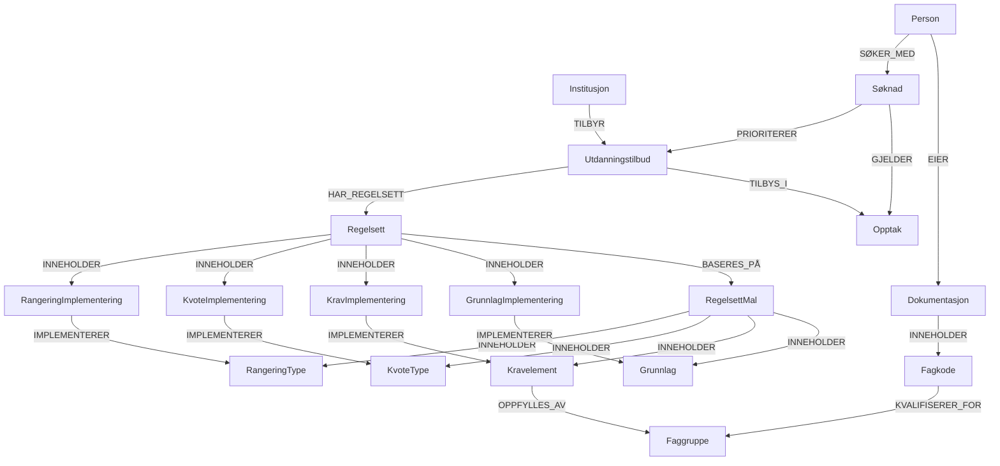

# 🗄️ Neo4j Datamodell - Opptakssystem

## 📊 Oversikt



## 🏷️ Node-typer

### 🏫 Institusjon

**Node label:** `Institusjon`

**Properties:**

- `id` (string, required, unique): Unik identifikator (f.eks. "ntnu", "uio")
- `navn` (string, required): Fullt navn (f.eks. "Norges teknisk-naturvitenskapelige universitet")
- `kortNavn` (string): Kort navn/akronym (f.eks. "NTNU")
- `type` (string): Type institusjon ("universitet", "høgskole", "fagskole", "privat")
- `institusjonsnummer` (string): Offisielt institusjonsnummer fra DBH
- `adresse` (string): Hovedadresse
- `nettside` (string): URL til hovedside
- `opprettet` (datetime): Når institusjonen ble opprettet i systemet
- `aktiv` (boolean): Om institusjonen er aktiv

**Constraints:**

```cypher
CREATE CONSTRAINT institusjon_id FOR (i:Institusjon) REQUIRE i.id IS UNIQUE;
CREATE CONSTRAINT institusjon_institusjonsnummer FOR (i:Institusjon) REQUIRE i.institusjonsnummer IS UNIQUE;
```

### 🎓 Utdanningstilbud

**Node label:** `Utdanningstilbud`

**Properties:**

- `id` (string, required, unique): Unik identifikator (f.eks. "ntnu-sykepleie-h25")
- `navn` (string, required): Navn på tilbudet (f.eks. "Bachelor i sykepleie")
- `studienivaa` (string): "bachelor", "master", "phd", "fagskole", "videreutdanning"
- `studiepoeng` (integer): Antall studiepoeng (f.eks. 180, 120)
- `varighet` (integer): Varighet i semestre
- `semester` (string): "host" eller "var"
- `aar` (integer): Oppstartsår (f.eks. 2025)
- `studiested` (string): Hvor studiet gjennomføres (f.eks. "Trondheim", "Gjøvik")
- `undervisningssprak` (string): "norsk", "engelsk", "begge"
- `maxAntallStudenter` (integer): Maks antall studieplasser
- `beskrivelse` (string): Utfyllende beskrivelse av studiet
- `opprettet` (datetime): Når tilbudet ble opprettet
- `aktiv` (boolean): Om tilbudet er aktivt

**Constraints:**

```cypher
CREATE CONSTRAINT utdanningstilbud_id FOR (u:Utdanningstilbud) REQUIRE u.id IS UNIQUE;
```

### 👤 Person

**Node label:** `Person`

**Properties:**

- `id` (string, required, unique): Unik identifikator (f.eks. UUID eller fødselsnummer-hash)
- `fornavn` (string, required): Fornavn
- `etternavn` (string, required): Etternavn
- `fodselsdato` (date, required): Fødselsdato
- `fodselsnummer` (string, required, unique): Fødselsnummer (kryptert/hashet)
- `epost` (string, required): E-postadresse
- `telefon` (string): Telefonnummer
- `adresse` (string): Bostedsadresse
- `postnummer` (string): Postnummer
- `poststed` (string): Poststed
- `statsborgerskap` (string): Statsborgerskap (f.eks. "norsk", "svensk")
- `opprettet` (datetime): Når personen ble registrert i systemet
- `aktiv` (boolean): Om personen er aktiv

**Constraints:**

```cypher
CREATE CONSTRAINT person_id FOR (p:Person) REQUIRE p.id IS UNIQUE;
CREATE CONSTRAINT person_fodselsnummer FOR (p:Person) REQUIRE p.fodselsnummer IS UNIQUE;
CREATE CONSTRAINT person_epost FOR (p:Person) REQUIRE p.epost IS UNIQUE;
```

### 📄 Dokumentasjon

**Node label:** `Dokumentasjon`

**Properties:**

- `id` (string, required, unique): Unik identifikator (f.eks. UUID)
- `type` (string, required): Type dokument ("vitnemaal", "fagbrev", "karakterutskrift", "spraaktest", "militaerattest", "annet")
- `navn` (string, required): Beskrivende navn (f.eks. "Vitnemål videregående skole")
- `utstedt` (date): Dato dokumentet ble utstedt
- `utsteder` (string): Hvem som utstedte dokumentet (f.eks. "Oslo katedralskole", "Folkeuniversitetet")
- `gyldigTil` (date): Utløpsdato (hvis relevant, f.eks. språktester)
- `opprettet` (datetime): Når dokumentet ble registrert
- `aktiv` (boolean): Om dokumentet er aktivt

**Constraints:**

```cypher
CREATE CONSTRAINT dokumentasjon_id FOR (d:Dokumentasjon) REQUIRE d.id IS UNIQUE;
```

### 🎯 Opptak

**Node label:** `Opptak`

**Properties:**

- `id` (string, required, unique): Unik identifikator (f.eks. "samordnet-h25")
- `navn` (string, required): Navn på opptaket (f.eks. "Samordnet opptak høst 2025")
- `type` (string, required): Type opptak ("samordnet", "lokalt", "direkte")
- `aar` (integer, required): År (f.eks. 2025)
- `soknadsfrist` (date): Søknadsfrist
- `svarfrist` (date): Frist for å svare på tilbud
- `maxSoknaderPerPerson` (integer): Maks antall søknader per person
- `status` (string): Status ("fremtidig", "apent", "stengt", "avsluttet")
- `opptaksomgang` (string): "hovedomgang", "tilleggsomgang", "lopende"
- `beskrivelse` (string): Beskrivelse av opptaket
- `opprettet` (datetime): Når opptaket ble opprettet
- `aktiv` (boolean): Om opptaket er aktivt

**Constraints:**

```cypher
CREATE CONSTRAINT opptak_id FOR (o:Opptak) REQUIRE o.id IS UNIQUE;
```

### 📝 Søknad

**Node label:** `Søknad`

**Properties:**

- `id` (string, required, unique): Unik identifikator (f.eks. UUID)
- `status` (string, required): Status ("utkast", "sendt", "behandlet", "avsluttet")
- `opprettet` (datetime): Når søknaden ble opprettet
- `sistEndret` (datetime): Sist endret
- `sendtInn` (datetime): Når søknaden ble sendt inn
- `kommentar` (string): Søkerens kommentarer/tilleggsinfo
- `aktiv` (boolean): Om søknaden er aktiv

**Constraints:**

```cypher
CREATE CONSTRAINT soknad_id FOR (s:Søknad) REQUIRE s.id IS UNIQUE;
```

### 📜 Regelsett

**Node label:** `Regelsett`

**Properties:**

- `id` (string, required, unique): Unik identifikator (f.eks. "ntnu-sykepleie-h25-regelsett")
- `navn` (string, required): Navn på regelsettet (f.eks. "Regelsett for Bachelor i sykepleie")
- `versjon` (string): Versjon (f.eks. "1.0", "2.1")
- `gyldigFra` (date): Fra hvilken dato regelsettet gjelder
- `gyldigTil` (date, optional): Til hvilken dato (hvis midlertidig)
- `beskrivelse` (string): Beskrivelse av regelsettet
- `opprettet` (datetime): Når regelsettet ble opprettet
- `aktiv` (boolean): Om regelsettet er aktivt

**Constraints:**

```cypher
CREATE CONSTRAINT regelsett_id FOR (r:Regelsett) REQUIRE r.id IS UNIQUE;
```

### 📋 RegelsettMal

**Node label:** `RegelsettMal`

**Properties:**

- `id` (string, required, unique): Unik identifikator (f.eks. "ingeniorutdanning-mal")
- `navn` (string, required): Navn på malen (f.eks. "Ingeniørutdanning")
- `beskrivelse` (string): Beskrivelse av malen
- `versjon` (string): Versjon av malen
- `opprettet` (datetime): Når malen ble opprettet
- `aktiv` (boolean): Om malen er aktiv

**Constraints:**

```cypher
CREATE CONSTRAINT regelsettmal_id FOR (rm:RegelsettMal) REQUIRE rm.id IS UNIQUE;
```

### 🏗️ Grunnlag (Standard)

**Node label:** `Grunnlag`

**Properties:**

- `id` (string, required, unique): Unik identifikator
- `navn` (string, required): Navn på grunnlaget (f.eks. "Vitnemål videregående")
- `type` (string, required): Type grunnlag ("vitnemaal-vgs", "fagbrev", "fagskole", "utenlandsk", "realkompetanse")
- `beskrivelse` (string): Beskrivelse av grunnlaget
- `aktiv` (boolean): Om grunnlaget er aktivt

**Constraints:**

```cypher
CREATE CONSTRAINT grunnlag_id FOR (g:Grunnlag) REQUIRE g.id IS UNIQUE;
```

### ✅ Kravelement (Standard)

**Node label:** `Kravelement`

**Properties:**

- `id` (string, required, unique): Unik identifikator
- `navn` (string, required): Navn på kravelementet (f.eks. "Generell studiekompetanse")
- `type` (string, required): Type krav ("gsk", "matematikk-r1", "alder", "erfaring", "språk")
- `beskrivelse` (string): Detaljert beskrivelse
- `aktiv` (boolean): Om kravelementet er aktivt

**Constraints:**

```cypher
CREATE CONSTRAINT kravelement_id FOR (ke:Kravelement) REQUIRE ke.id IS UNIQUE;
```

### 📊 KvoteType (Standard)

**Node label:** `KvoteType`

**Properties:**

- `id` (string, required, unique): Unik identifikator
- `navn` (string, required): Navn på kvotetypen (f.eks. "Ordinær kvote")
- `type` (string, required): Type kvote ("ordinaer", "forstegangsvitnemaal", "forkurs", "internasjonal")
- `beskrivelse` (string): Beskrivelse av kvotetypen
- `aktiv` (boolean): Om kvotetypen er aktiv

**Constraints:**

```cypher
CREATE CONSTRAINT kvotetype_id FOR (kt:KvoteType) REQUIRE kt.id IS UNIQUE;
```

### 📈 RangeringType (Standard)

**Node label:** `RangeringType`

**Properties:**

- `id` (string, required, unique): Unik identifikator
- `navn` (string, required): Navn på rangeringstypen (f.eks. "Karaktersnitt + realfagspoeng")
- `type` (string, required): Type rangering ("karaktersnitt", "fagbrev", "arbeidserfaring", "kombinert")
- `formelMal` (string): Mal for rangeringsformelen
- `beskrivelse` (string): Detaljert beskrivelse
- `aktiv` (boolean): Om rangeringstypen er aktiv

**Constraints:**

```cypher
CREATE CONSTRAINT rangeringtype_id FOR (rt:RangeringType) REQUIRE rt.id IS UNIQUE;
```

### 🏗️ GrunnlagImplementering

**Node label:** `GrunnlagImplementering`

**Properties:**

- `id` (string, required, unique): Unik identifikator
- `navn` (string, required): Navn på implementeringen
- `beskrivelse` (string): Spesifikk beskrivelse for dette utdanningstilbudet
- `prioritet` (integer): Visningsrekkefølge
- `opprettet` (datetime): Når implementeringen ble opprettet
- `aktiv` (boolean): Om implementeringen er aktiv

**Constraints:**

```cypher
CREATE CONSTRAINT grunnlagimplementering_id FOR (gi:GrunnlagImplementering) REQUIRE gi.id IS UNIQUE;
```

### ✅ KravImplementering

**Node label:** `KravImplementering`

**Properties:**

- `id` (string, required, unique): Unik identifikator
- `navn` (string, required): Navn på kravimplementeringen
- `spesifikkeKrav` (string): Utdanningstilbud-spesifikke krav og verdier
- `beskrivelse` (string): Detaljert beskrivelse
- `opprettet` (datetime): Når implementeringen ble opprettet
- `aktiv` (boolean): Om implementeringen er aktiv

**Constraints:**

```cypher
CREATE CONSTRAINT kravimplementering_id FOR (ki:KravImplementering) REQUIRE ki.id IS UNIQUE;
```

### 📊 KvoteImplementering

**Node label:** `KvoteImplementering`

**Properties:**

- `id` (string, required, unique): Unik identifikator
- `navn` (string, required): Navn på kvoteimplementeringen
- `antallPlasser` (integer): Antall studieplasser i kvoten
- `prosentAndel` (float): Prosentandel av totale plasser (hvis ikke fast antall)
- `beskrivelse` (string): Beskrivelse av kvoten
- `opprettet` (datetime): Når implementeringen ble opprettet
- `aktiv` (boolean): Om implementeringen er aktiv

**Constraints:**

```cypher
CREATE CONSTRAINT kvoteimplementering_id FOR (ki:KvoteImplementering) REQUIRE ki.id IS UNIQUE;
```

### 📈 RangeringImplementering

**Node label:** `RangeringImplementering`

**Properties:**

- `id` (string, required, unique): Unik identifikator
- `navn` (string, required): Navn på rangeringsimplementeringen
- `formel` (string): Konkret rangeringsformel for dette utdanningstilbudet
- `vektinger` (string): Spesifikke vektinger og parametre
- `beskrivelse` (string): Detaljert beskrivelse
- `opprettet` (datetime): Når implementeringen ble opprettet
- `aktiv` (boolean): Om implementeringen er aktiv

**Constraints:**

```cypher
CREATE CONSTRAINT rangeringimplementering_id FOR (ri:RangeringImplementering) REQUIRE ri.id IS UNIQUE;
```

### 📚 Fagkode

**Node label:** `Fagkode`

**Properties:**

- `id` (string, required, unique): Unik identifikator
- `kode` (string, required): Fagkoden (f.eks. "MAT1001-S1", "3MX", "REA3")
- `navn` (string, required): Navn på faget
- `beskrivelse` (string): Beskrivelse av faget
- `gyldigFra` (date): Fra hvilken dato fagkoden var/er gyldig
- `gyldigTil` (date): Til hvilken dato (hvis utfaset)
- `aktiv` (boolean): Om fagkoden er aktiv

**Constraints:**

```cypher
CREATE CONSTRAINT fagkode_id FOR (fk:Fagkode) REQUIRE fk.id IS UNIQUE;
CREATE CONSTRAINT fagkode_kode FOR (fk:Fagkode) REQUIRE fk.kode IS UNIQUE;
```

### 🎯 Faggruppe

**Node label:** `Faggruppe`

**Properties:**

- `id` (string, required, unique): Unik identifikator
- `navn` (string, required): Navn på faggruppen (f.eks. "Matematikk R1-nivå")
- `beskrivelse` (string): Beskrivelse av hva som kreves
- `type` (string): Type faggruppe ("matematikk", "norsk", "naturfag", etc.)
- `aktiv` (boolean): Om faggruppen er aktiv

**Constraints:**

```cypher
CREATE CONSTRAINT faggruppe_id FOR (fg:Faggruppe) REQUIRE fg.id IS UNIQUE;
```

## 📝 Eksempel: S1 + S2 = R1-nivå

**Fagkoder:**

```cypher
CREATE (s1:Fagkode {
  id: "mat-s1",
  kode: "MAT1001-S1",
  navn: "Matematikk S1",
  aktiv: true
});

CREATE (s2:Fagkode {
  id: "mat-s2",
  kode: "MAT1002-S2",
  navn: "Matematikk S2",
  aktiv: true
});

CREATE (r1:Fagkode {
  id: "mat-r1",
  kode: "MAT1014-R1",
  navn: "Matematikk R1",
  aktiv: true
});
```

**Faggruppe:**

```cypher
CREATE (fg:Faggruppe {
  id: "matematikk-r1-nivaa",
  navn: "Matematikk R1-nivå",
  type: "matematikk",
  beskrivelse: "Matematikk på R1-nivå eller tilsvarende",
  aktiv: true
});
```

**Kvalifisering:**

```cypher
// Direkte kvalifisering
CREATE (r1)-[:KVALIFISERER_FOR]->(fg);

// Kombinasjonskrav (krever begge S1 og S2)
CREATE (s1)-[:KVALIFISERER_FOR {kreverKombinasjon: ["MAT1002-S2"]}]->(fg);
CREATE (s2)-[:KVALIFISERER_FOR {kreverKombinasjon: ["MAT1001-S1"]}]->(fg);
```

**Dokumentasjon med fagkoder og karakterer:**

```cypher
CREATE (vitnemal:Dokumentasjon {
  id: "ole-vitnemal-vgs",
  navn: "Vitnemål videregående skole",
  type: "vitnemaal"
});

// Ole har S1 med karakter 5 og S2 med karakter 4
CREATE (vitnemal)-[:INNEHOLDER {karakter: "5"}]->(s1);
CREATE (vitnemal)-[:INNEHOLDER {karakter: "4"}]->(s2);
```

## 🌳 Regelsett som tre-struktur

Et regelsett bygges opp som en tre-struktur hvor:

1. **GrunnlagImplementering** definerer hva som kvalifiserer (basert på standard Grunnlag)
2. **KravImplementering** knyttes til grunnlag (basert på standard Kravelement)
3. **KvoteImplementering** som grunnlaget gir tilgang til (basert på standard KvoteType)
4. **RangeringImplementering** som brukes innenfor hver kvote (basert på standard RangeringType)

**Eksempel på tre-struktur med Type/Implementering:**

```
📋 RegelsettMal: "Ingeniørutdanning"
├── 🏗️ Grunnlag: "Vitnemål videregående" (standard)
├── ✅ Kravelement: "GSK" (standard)
├── 📊 KvoteType: "Ordinær kvote" (standard)
└── 📈 RangeringType: "Karaktersnitt + realfag" (standard)

↓ Implementeres som:

📜 Regelsett: "NTNU Bygg- og miljøteknikk H25"
├── 🏗️ GrunnlagImplementering: "Vitnemål videregående - NTNU"
│   ├── ✅ KravImplementering: "GSK med minimumskarakter 3.0"
│   ├── ✅ KravImplementering: "Matematikk R1 med karakter 4+"
│   ├── 📊 KvoteImplementering: "Ordinær kvote (60 plasser)" → 📈 RangeringImplementering: "Karaktersnitt + 2x realfag"
│   └── 📊 KvoteImplementering: "Førstegangsvitnemål (60 plasser)" → 📈 RangeringImplementering: "Karaktersnitt + 2x realfag"
├── 🏗️ GrunnlagImplementering: "Fagbrev - NTNU"
│   ├── ✅ KravImplementering: "Relevant fagbrev (bygg/anlegg)"
│   ├── ✅ KravImplementering: "Matematikk R1 med karakter 3+"
│   └── 📊 KvoteImplementering: "Ordinær kvote (60 plasser)" → 📈 RangeringImplementering: "Fagbrev 40% + realfag 60%"
```

## ⚡ Gjenbruk og propagering

- **Standard-komponenter** kan gjenbrukes på tvers av institusjoner
- Endringer i **standarder** kan propageres til alle **implementeringer**
- **Implementeringer** kan tilpasses uten å påvirke standardene
- Historikk bevares ved versjonering av både standarder og implementeringer

## 🔍 Design-beslutning: KravImplementering vs direkte referanse

**Spørsmål:** Skal GrunnlagImplementering peke direkte på Kravelement eller via KravImplementering?

**Svar:** Via KravImplementering, fordi krav kan ha utdanningstilbud-spesifikke parametre:

**Eksempel:**

- **Standard Kravelement:** "Matematikk R2"
- **NTNU KravImplementering:** "Matematikk R2 med minimum karakter 4.0"
- **UiO KravImplementering:** "Matematikk R2 med minimum karakter 3.5"

**Struktur:**

```
GrunnlagImplementering -[:KREVER]-> KravImplementering -[:IMPLEMENTERER]-> Kravelement
```

## 📊 Query-eksempler

**Finn alle utdanningstilbud med mattekrav:**

```cypher
// Grunnleggende query
MATCH (u:Utdanningstilbud)-[:HAR_REGELSETT]->(r:Regelsett)
      -[:INNEHOLDER]->(gi:GrunnlagImplementering)
      -[:KREVER]->(ki:KravImplementering)
      -[:IMPLEMENTERER]->(ke:Kravelement)
WHERE ke.type CONTAINS "matematikk"
RETURN u;

// Med index for performance
CREATE INDEX kravelement_type FOR (ke:Kravelement) ON (ke.type);

// Kort query med variable path length
MATCH (u:Utdanningstilbud)-[*]-(ke:Kravelement)
WHERE ke.type CONTAINS "matematikk"
RETURN u;
```

**Finn spesifikke implementeringer:**

```cypher
// Alle utdanningstilbud som krever Matte R2 med karakter 4+
MATCH (u:Utdanningstilbud)-[*]-(ki:KravImplementering)-[:IMPLEMENTERER]->(ke:Kravelement)
WHERE ke.type = "matematikk-r2"
  AND ki.spesifikkeKrav CONTAINS "karakter 4"
RETURN u, ki.spesifikkeKrav;
```

**Fordeler med implementerings-lag:**

- ✅ Fleksibilitet: Utdanningstilbud kan tilpasse standardkrav
- ✅ Querybarhet: Kan søke både generelt ("alle med matte") og spesifikt ("matte R2 karakter 4+")
- ✅ Performance: Neo4j optimalisert for relasjonstraversering
- ✅ Gjenbruk: Standardkrav kan brukes av mange implementeringer

## 🔗 Relationship-typer

### Institusjon TILBYR Utdanningstilbud

**Properties:** (ingen foreløpig)

**Beskrivelse:** En institusjon tilbyr et utdanningstilbud

### Person EIER Dokumentasjon

**Properties:** (ingen)

**Beskrivelse:** En person eier sin dokumentasjon

### Utdanningstilbud TILBYS_I Opptak

**Properties:** (ingen foreløpig)

**Beskrivelse:** Et utdanningstilbud tilbys i et opptak

### Person SØKER_MED Søknad

**Properties:** (ingen)

**Beskrivelse:** En person søker med en søknad

### Søknad GJELDER Opptak

**Properties:** (ingen)

**Beskrivelse:** Søknaden gjelder et opptak

### Søknad PRIORITERER Utdanningstilbud

**Properties:**

- `prioritet` (integer, required): Prioritet (1 = høyest prioritet)
- `opprettet` (datetime): Når prioriteringen ble satt

**Beskrivelse:** Søknaden prioriterer utdanningstilbud

### Utdanningstilbud HAR_REGELSETT Regelsett

**Properties:** (ingen)

**Beskrivelse:** Et utdanningstilbud har et regelsett som definerer opptakskrav

### Regelsett BASERES_PÅ RegelsettMal

**Properties:** (ingen)

**Beskrivelse:** Et regelsett baseres på en regelsettmal

### Regelsett INNEHOLDER GrunnlagImplementering

**Properties:** (ingen)

**Beskrivelse:** Et regelsett inneholder grunnlagimplementeringer

### Regelsett INNEHOLDER KravImplementering

**Properties:** (ingen)

**Beskrivelse:** Et regelsett inneholder kravimplementeringer

### Regelsett INNEHOLDER KvoteImplementering

**Properties:** (ingen)

**Beskrivelse:** Et regelsett inneholder kvoteimplementeringer

### Regelsett INNEHOLDER RangeringImplementering

**Properties:** (ingen)

**Beskrivelse:** Et regelsett inneholder rangeringimplementeringer

### RegelsettMal INNEHOLDER Grunnlag

**Properties:** (ingen)

**Beskrivelse:** En regelsettmal inneholder standard grunnlag

### RegelsettMal INNEHOLDER Kravelement

**Properties:** (ingen)

**Beskrivelse:** En regelsettmal inneholder standard kravelementer

### RegelsettMal INNEHOLDER KvoteType

**Properties:** (ingen)

**Beskrivelse:** En regelsettmal inneholder standard kvotetyper

### RegelsettMal INNEHOLDER RangeringType

**Properties:** (ingen)

**Beskrivelse:** En regelsettmal inneholder standard rangeringstyper

### GrunnlagImplementering IMPLEMENTERER Grunnlag

**Properties:** (ingen)

**Beskrivelse:** En grunnlagimplementering implementerer et standard grunnlag

### KravImplementering IMPLEMENTERER Kravelement

**Properties:** (ingen)

**Beskrivelse:** En kravimplementering implementerer et standard kravelement

### KvoteImplementering IMPLEMENTERER KvoteType

**Properties:** (ingen)

**Beskrivelse:** En kvoteimplementering implementerer en standard kvotetype

### RangeringImplementering IMPLEMENTERER RangeringType

**Properties:** (ingen)

**Beskrivelse:** En rangeringimplementering implementerer en standard rangeringstype

### GrunnlagImplementering KREVER KravImplementering

**Properties:** (ingen)

**Beskrivelse:** En grunnlagimplementering krever at visse kravimplementeringer er oppfylt

### GrunnlagImplementering GIR_TILGANG_TIL KvoteImplementering

**Properties:** (ingen)

**Beskrivelse:** En grunnlagimplementering gir tilgang til en eller flere kvoteimplementeringer

### KvoteImplementering BRUKER RangeringImplementering

**Properties:** (ingen)

**Beskrivelse:** En kvoteimplementering bruker en rangeringimplementering for å sortere søkere

### Dokumentasjon INNEHOLDER Fagkode

**Properties:**

- `karakter` (string): Karakter oppnådd i faget (1-6, eller bestått/ikke bestått)

**Beskrivelse:** En dokumentasjon inneholder fagkoder med oppnådde karakterer

### Fagkode KVALIFISERER_FOR Faggruppe

**Properties:**

- `kreverKombinasjon` (array, optional): Liste over andre fagkoder som må være til stede samtidig

**Beskrivelse:** En fagkode kvalifiserer for en faggruppe, eventuelt i kombinasjon med andre fagkoder

### Kravelement OPPFYLLES_AV Faggruppe

**Properties:** (ingen)

**Beskrivelse:** Et kravelement oppfylles av en faggruppe
